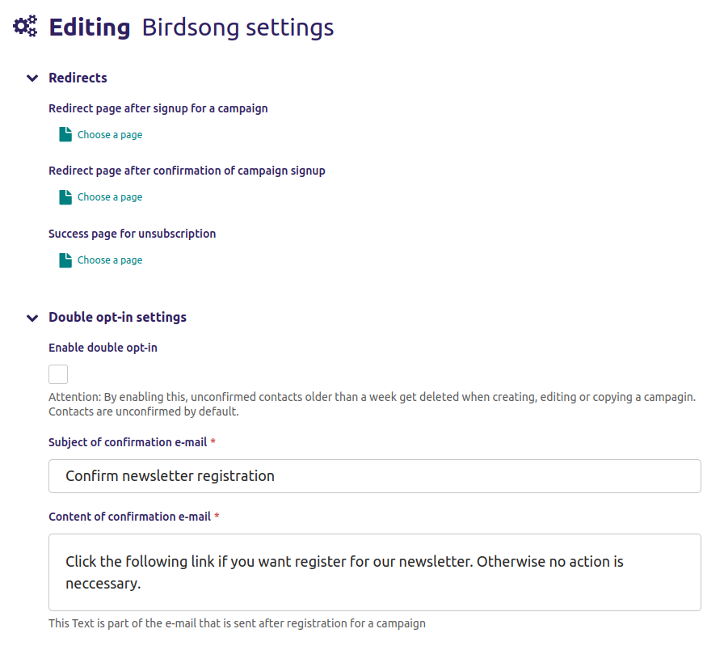

A plugin for wagtail that allows you to create, send, preview, edit and test email campaigns from within Wagtail.
Campaign templates are created using `mjml <https://mjml.io/>`_.

Tutorial - https://engineertodeveloper.com/how-to-add-an-email-newsletter-to-wagtail/

Basic usage
===========

Install birdsong:

.. code-block:: shell
    
    pip install wagtail-birdsong

Add the following to your installed apps:

.. code-block:: python

    'mjml',
    'birdsong',
    'wagtail.contrib.modeladmin',

Make a new app e.g. ``email``, create a ``models.py`` with a model that extends the included ``Campaign`` model. Some compatible mjml streamfield blocks are included in birdsong for convenience.

.. code-block:: python

    from birdsong.blocks import DefaultBlocks
    from birdsong.models import Campaign
    from django.db import models
    from wagtail.admin.edit_handlers import StreamFieldPanel
    from wagtail.core.fields import StreamField

    class SaleEmail(Campaign):
        body = StreamField(DefaultBlocks())

        panels = Campaign.panels + [
            StreamFieldPanel('body'),
        ]

Then in the same app, create a ``wagtail_hooks.py`` if it doesn't exist, this is where the admin is created
for content editors to create/edit/send campaigns.

The ``CampaignAdmin`` is just an extension of Wagtail's ``ModelAdmin`` class so most of the same options are available for overriding functionality.

.. code-block:: python

    from wagtail.contrib.modeladmin.options import modeladmin_register
    from birdsong.options import CampaignAdmin

    from .models import SaleEmail

    @modeladmin_register
    class SaleEmailAdmin(CampaignAdmin):
        campaign = SaleEmail
        menu_label = 'Sale Email'
        menu_icon = 'mail'
        menu_order = 200

Create your campaign template in ``{app_folder}/templates/mail/{model_name}.html`` e.g. ``email/templates/mail/sale_email.html``,
alternatively override the ``get_template`` method on your campaign model.

Campaign templates use django-mjml for responsive, well designed emails. To read up how to setup django-mjml you can read the docs `here <https://github.com/liminspace/django-mjml>`_. There is a base template included in Birdsong that can be extended.

``sale_email.html``

.. code-block:: html

    

    
    <mj-section>
        <mj-column>
            <mj-text>Hello {{ contact.email }}!</mj-text>
            
                {{ b }}
            
        </mj-column>
    </mj-section>
    

You're now ready to go!

.. image:: docs/birdsong-preview.png
    :width: 900
    :alt: Screenshot

Custom Contact models
=====================

By default the included ``Contact`` model is used for every campaign, but you may want to store extra data, like names and preferences. 
You can override the default ``Contact`` model by setting an option on the admin for your campaign:

``models.py``

.. code-block:: python

    from birdsong.models import Contact
    from django.db import models

    class ExtendedContact(Contact):
        first_name = models.CharField(max_length=255)
        last_name = models.CharField(max_length=255)
        location = models.CharField(max_length=255)

``wagtail_hooks.py``

.. code-block:: python

    from wagtail.contrib.modeladmin.options import ModelAdmin, modeladmin_register
    from birdsong.options import CampaignAdmin

    from .models import ExtendedContact, SaleEmail

    @modeladmin_register
    class SaleEmailAdmin(CampaignAdmin):
        campaign = SaleEmail
        menu_label = 'Sale Email'
        menu_icon = 'mail'
        menu_order = 200
        contact_class = ExtendedContact

    # You may want to add your own modeladmin here to list/edit/add contacts
    @modeladmin_register
    class ContactAdmin(ModelAdmin):
        model = ExtendedContact
        menu_label = 'Contacts'
        menu_icon = 'user'
        list_diplay = ('email', 'first_name', 'last_name', 'location')

``base.py``

.. code-block:: python

    # You may want to redefine the test contact (used in previews) with your new ExtendedContact fields
    BIRDSONG_TEST_CONTACT = {
        'first_name': 'Wagtail',
        'last_name': 'Birdsong',
        'email': 'wagtail.birdsong@example.com',
        'location': 'us',
    }

Filtering on contact properties
===============================

You might want to only send a campaign to a subset of your ``Contact`` models. Creating a filter using `django-filter <https://django-filter.readthedocs.io/en/main/>`_ and adding it to the ``CampaignAdmin`` allows users to filter on any property.

``filters.py``

.. code-block:: python

    from django_filters import FilterSet
    from django_filters.filters import AllValuesFilter

    from .models import ExtendedContact

    class ContactFilter(FilterSet):
        location = AllValuesFilter()

        class Meta:
            model = ExtendedContact
            fields = ('location',)

``wagtail_hooks.py``

.. code-block:: python

    from wagtail.contrib.modeladmin.options import modeladmin_register
    from birdsong.options import CampaignAdmin

    from .filters import ContactFilter
    from .models import ExtendedContact, SaleEmail

    @modeladmin_register
    class SaleEmailAdmin(CampaignAdmin):
        campaign = SaleEmail
        menu_label = 'Sale Email'
        menu_icon = 'mail'
        menu_order = 200
        contact_class = ExtendedContact
        contact_filter_class = ContactFilter

Users will now be able to send campaigns to a subset of contacts base on location.

Unsubscribe url
===============

Included in birdsong is a basic way for contacts to unsubscribe, just include the url configuration and add the unsubscribe url to your email template.

``urls.py``

.. code-block:: python

    from birdsong import urls as birdsong_urls
    from django.urls import include, path

    urlpatterns = [
        ...
        path('mail/', include(birdsong_urls)),
        ...
    ]

``sale_email.html``

.. code-block:: html

    

    
    <mj-section>
        <mj-column>
            <mj-text>Hello {{ contact.email }}!</mj-text>
            
                {{ b }}
            
        </mj-column>
    </mj-section>
    <mj-section>
        <mj-column>
            <mj-text align="center">
                Click <a href="{{ site.full_url }}">here</a> to unsubscribe.
            </mj-text>
        </mj-column>
    </mj-section>
    

Birdsong settings 
=================

The website's admin can set settings with regard to

- redirects
- double opt-in 

If a redirect is set, the original template will not be used anymore.

Double opt in
=============

For security reasons it is better if a double opt-in is used for subscription. 
It assures sending the campaign only to people who agreed to it and follows the regulations of EU's GDPR. 
The double opt-in feature can be enabled in 'Birdsong settings' in the admin menu. 
The subscribing person will receive an e-mail with a link for confirmation. 
Unconfirmed contacts older than a week are deleted, when a campaign is saved, so when creating, editing or copying.

**!! Warning !!** 
By enabling this feature without garantueeing that field ``is_confirmed`` is ``True`` of the old contacts, the ones who are older than a week will be deleted when campaign saving is triggered!

Future features:
----------------

- More tests!
- Proper docs
- Backends other thans SMTP for sending emails so analytics can be gathered (email opened, bounced etc)
- Reloading the preview on edit
- Broader permissions for campaigns (send, preview, test send)
spot